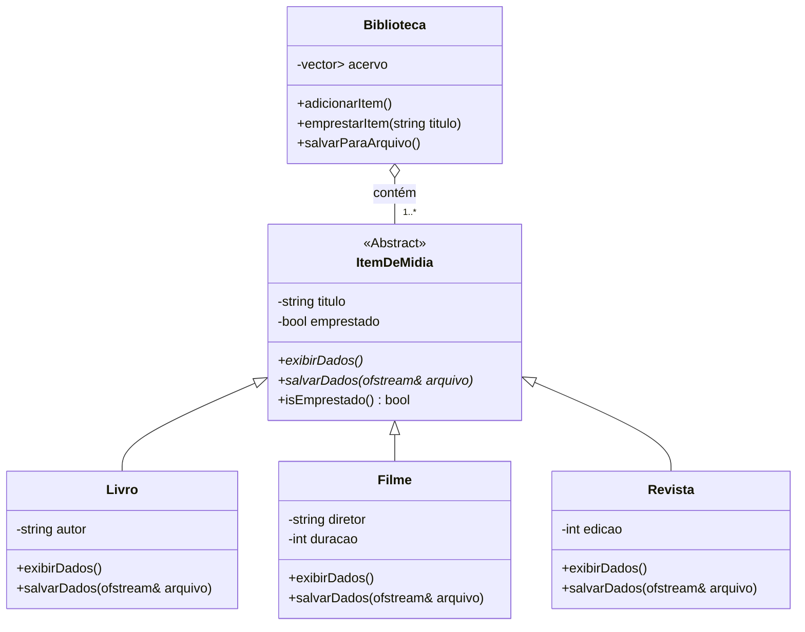

<div align="center">

# 💿 Estudo de Caso: Arquitetura C++ com POO e Gerenciamento Moderno de Memória

**Um sistema de gerenciamento de biblioteca de mídia construído em C++ para demonstrar um domínio profundo sobre os pilares da Programação Orientada a Objetos, design de software e as melhores práticas do C++ Moderno.**

<br>


<br>
<br>


</div>

---

> 💡 **Nota do Desenvolvedor:** Este projeto é o meu mergulho mais profundo nos fundamentos da engenharia de software. O objetivo não foi apenas "fazer funcionar", mas sim construir um sistema da maneira correta, com uma arquitetura coesa, código limpo e, acima de tudo, um gerenciamento de memória seguro e moderno, utilizando as melhores práticas que o C++ oferece. É a minha demonstração de como construir software robusto e resiliente a partir dos primeiros princípios.

<br>

## 📜 Índice

* [✨ Funcionalidades Principais](#-funcionalidades-principais)
* [🏆 Vitrine Técnica: Conceitos Aplicados](#-vitrine-técnica-conceitos-aplicados)
* [🏛️ Diagrama de Classes (UML)](#️-diagrama-de-classes-uml)
* [🚀 Como Compilar e Executar](#-como-compilar-e-executar)

---

## ✨ Funcionalidades Principais

O sistema vai além de um simples cadastro, implementando uma lógica de negócio completa para o gerenciamento de uma biblioteca.

| Funcionalidade | Descrição | Status |
| :--- | :--- | :---: |
| 💿 **Gerenciamento de Mídia** | Adicione, busque e remova diferentes tipos de mídia (Livros, Filmes, Revistas) com atributos específicos. | ✅ |
| 🔄 **Controle de Empréstimos** | Altere o status de um item entre "Disponível" e "Emprestado", simulando a lógica de negócio principal. | ✅ |
| 🔍 **Listagem Polimórfica** | Liste todos os itens da biblioteca de forma unificada, onde cada tipo de mídia se exibe de maneira correta. | ✅ |
| 💾 **Persistência de Dados** | Salve o estado da biblioteca em um arquivo `biblioteca.txt` e carregue-o automaticamente ao iniciar. | ✅ |
| 🛠️ **Build Automatizado** | Use um `Makefile` para compilar todo o projeto com um único comando (`make`), como em ambientes profissionais. | ✅ |

---

## 🏆 Vitrine Técnica: Conceitos Aplicados

Este projeto foi deliberadamente estruturado para ser uma vitrine de conceitos avançados de C++ e design de software.

| Conceito-Chave | Implementação e Justificativa |
| :--- | :--- |
| 🧠 **Polimorfismo em Tempo de Execução** | O pilar do projeto. Através de **funções virtuais** (`virtual` / `override`) e uma classe base abstrata, o sistema manipula um `std::vector` de ponteiros `ItemDeMidia*`, permitindo que o código trate todos os objetos de forma genérica, enquanto o comportamento correto é decidido em tempo de execução. |
| 💎 **Gerenciamento Moderno de Memória** | Para garantir segurança e prevenir vazamentos, o projeto utiliza **`std::unique_ptr`** em vez de ponteiros brutos (`new`/`delete`). Isso implementa o princípio de **RAII** (Resource Acquisition Is Initialization), automatizando a liberação de memória e tornando o código mais seguro e limpo. |
| 🏰 **Hierarquia de Classes com Herança** | Uma classe base abstrata `ItemDeMidia` define um "contrato" que todas as mídias devem seguir. Classes concretas como `Livro` e `Filme` herdam dela, promovendo a reutilização de código e um design lógico e coeso. |
| 🛡️ **Encapsulamento** | Os atributos das classes são mantidos como `private` ou `protected`, com acesso controlado através de métodos públicos (`getters`/`setters`), protegendo a integridade dos dados de cada objeto. |
| 📂 **Organização de Código Profissional** | O código é modularizado em arquivos de cabeçalho (`.h` para declarações) e implementação (`.cpp`), uma prática padrão da indústria que melhora a legibilidade, manutenção e o tempo de compilação. |

---

## 🏛️ Diagrama de Classes (UML)

O diagrama abaixo ilustra a arquitetura orientada a objetos do sistema.


> **Nota:** O diagrama simplifica as classes para focar na arquitetura. A relação `Biblioteca o-- ItemDeMidia` indica uma **Composição** gerenciada por `unique_ptr`, onde a `Biblioteca` é "dona" dos itens e responsável por seu ciclo de vida.

---

## 🚀 Como Compilar e Executar

### Pré-requisitos
* Um compilador C++ moderno (g++, Clang, etc.).
* A ferramenta `make` instalada.

### Passos

1.  **Clone o repositório:**
    ```bash
    git clone [https://github.com/SEU_USUARIO/SEU_REPOSITORIO.git](https://github.com/SEU_USUARIO/SEU_REPOSITORIO.git)
    cd SEU_REPOSITORIO
    ```
2.  **Compile com o Makefile:**
    * No terminal, na raiz do projeto, execute o comando `make`.
    ```bash
    make
    ```
3.  **Execute o programa:**
    * Um executável chamado `biblioteca` será criado. Para rodá-lo:
    ```bash
    ./biblioteca
    ```
4.  **Limpeza (Opcional):**
    * Para remover os arquivos compilados (`.o`) e o executável:
    ```bash
    make clean
    ```
